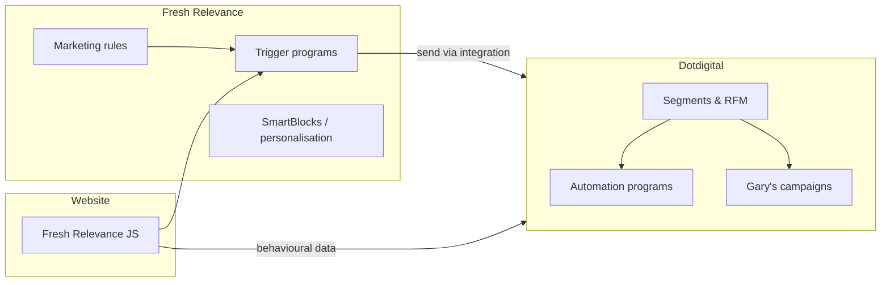

# Dotdigital Migration & Automation Research

**Purpose:** Research and planning document for the move to Dotdigital (live sending from **September**), segment-based automations, and Fresh Relevance trigger programs.

**Related:** [Fresh Relevance trigger settings best practices](./fresh-relevance-trigger-settings-best-practices.md)

---

## 1. Context & timeline

| Phase | When | What |
|-------|------|------|
| Contract signed | TBC | Dotdigital grant platform access — **no live sending yet** |
| Setup window | Now → September | Learn the platform, configure programs, align with Fresh Relevance |
| Go-live | September | Automations and campaigns begin sending |
| Professional services | Optional | Purchase service credits — Dotdigital can help build programs and emails |

### Strategic split

- **Gary** — continues general / broadcast email campaigns (newsletters, promotions, seasonal sends).
- **New automations** — segment-driven lifecycle programs sitting **outside** Gary’s regular sends (cart/browse abandon, welcome, lapsing, etc.).
- **Jemma** — likely owns segment definitions for standard sends; anything tied to Fresh Relevance data should be reviewed together so segments and triggers stay aligned.

### Recommended next steps (next few weeks)

1. Complete this research and agree priority automations.
2. **Session with Jemma** — walk through existing Fresh Relevance data, segments, and what’s usable in Dotdigital (see §7).
3. When platform access arrives: complete Dotdigital Academy automation course (~99 min).
4. Decide which programs to build in-house vs. fund via professional services credits.
5. Configure Fresh Relevance trigger settings before enabling live triggers (see §5 & linked doc).

---

## 2. Automation best practices by program

General principles across all programs:

- **Quality over quantity** — engaged contacts only; poor lists hurt deliverability.
- **Personalisation** — use browse/purchase history, not generic blasts.
- **Test one variable at a time** — timing, subject line, offer type, sequence length.
- **Exit on purchase / unsubscribe** — always suppress people who convert or opt out mid-flow.
- **RFM where relevant** — recency, frequency, monetary value to decide who gets discounts vs. nudges only ([Dotdigital cart abandonment guide](https://dotdigital.com/blog/how-to-drive-revenue-from-abandoned-carts/)).
- **Start simple** — even a single well-built email beats a complex unfinished flow.

---

### 2.1 Cart abandonment

**What it is:** Shopper adds to cart but doesn’t complete checkout.

**Why it matters:** High-intent audience; among the highest revenue automations. Industry cart abandon rates can reach ~80%. Fresh Relevance clients often see meaningful uplift from cart recovery (Dotdigital cites ~7% sales uplift as an average among FR clients).

**Best practice**

| Element | Recommendation |
|---------|----------------|
| **Timing** | Email 1 within **~1 hour** of abandon; email 2 at **~24h**; optional email 3 at **~48h** |
| **Content** | Exact cart contents, images, one-click return to cart; social proof (reviews); urgency only if genuine (stock, season) |
| **Discounts** | Don’t default to discounts for everyone — use RFM; savvy shoppers abandon intentionally for codes |
| **Sequence length** | Test **1 vs 3 stages**; Awaze case study: ~14% conversion on first email, ~3% on second (24h later) |
| **Technical** | Auto-apply any offer; minimise steps back to checkout |

**Fresh Relevance note:** FR captures cart signals via site JS and can trigger via email/SMS with marketing rules (cart value, category, SKU, time of day). Align FR abandon delay (min **15 min** unattended) with Dotdigital program timing.

**Sources:** [Dotdigital cart abandonment](https://dotdigital.com/blog/how-to-drive-revenue-from-abandoned-carts/), [Five email programs](https://dotdigital.com/blog/five-email-programs-to-stand-out-in-the-inbox/)

---

### 2.2 Browse abandonment

**What it is:** Visitor browses products but leaves **without** adding to cart. Lower intent than cart abandon; different messaging.

**Best practice**

| Element | Recommendation |
|---------|----------------|
| **Timing** | First email within **~1 hour** of session end |
| **Content** | Products viewed, similar recommendations, brand story, delivery/USPs — **not** “your cart” messaging |
| **Differentiation** | Don’t treat browse and cart abandon as the same program |
| **Overlap control** | Use FR **remarketing slice size** so cart abandon doesn’t block browse abandon (or vice versa) within the same window |

**Fresh Relevance note:** FR supports browse abandon triggers, product-level rules, and “one site brand per browse email” if you have multiple brands.

**Sources:** [Dotdigital browse abandonment](https://dotdigital.com/blog/the-complete-guide-to-cart-abandonment/) (browse section), [DHL/Dotdigital e-commerce guide](https://www.dhl.com/discover/en-sg/e-commerce-advice/e-commerce-best-practice/email-marketing-advice)

---

### 2.3 Welcome series — new subscribers (pre-purchase)

**What it is:** First emails after email signup, **before** first purchase.

**Best practice — typical 3-part series**

| Email | Purpose | Content |
|-------|---------|---------|
| **1** | Thank you + set expectations | USPs, benefits of subscribing, welcome discount if offered |
| **2** | Brand relationship | Brand story, bestsellers, social proof, inspiration (seasonal planting tips for YouGarden) |
| **3** | Drive action | CTA to first purchase **or** preference centre if already bought |

**Sign-up with discount code**

- If signup promises a code, deliver it in **email 1** (or on confirmation page + email).
- Be clear on terms (expiry, minimum spend, exclusions).
- Consider separate track: **signup + code, no purchase after X days** → gentle reminder before expiry.

**Stats:** ~74% of consumers expect a welcome email; welcome emails often see **4× opens and 5× clicks** vs. regular campaigns.

**Sources:** [Five email programs](https://dotdigital.com/blog/five-email-programs-to-stand-out-in-the-inbox/), [DHL/Dotdigital guide](https://www.dhl.com/discover/en-sg/e-commerce-advice/e-commerce-best-practice/email-marketing-advice)

---

### 2.4 Welcome / onboarding — new buyers (post-first-purchase)

**What it is:** First purchase completed — distinct from pre-purchase welcome.

**Best practice**

| Element | Recommendation |
|---------|----------------|
| **Timing** | Thank-you within order confirmation flow; care tips **2–3 days** after delivery (when relevant) |
| **Content** | Product care/how-to (critical for plants), complementary products (tactful), review request |
| **Goal** | Reduce returns, build loyalty, second purchase — not hard sell immediately |
| **Review ask** | Include product image; offer small incentive for feedback; route issues to CS before public review |

Overlap with **post-purchase program** (§2.5) — decide whether “new buyer” is a dedicated short series or part of a broader post-purchase flow.

---

### 2.5 Post-purchase (repeat buyers)

**Transactional + marketing**

- Order confirmation, dispatch, delivery — on-brand, not “vanilla”.
- Cross-sell only when closely related to what they bought.
- Replenishment triggers for consumables / seasonal replant cycles (see §2.6).

---

### 2.6 Product replenishment (if applicable)

For products with predictable repurchase cycles (consumables, seasonal replants):

- Trigger based on **median days between orders** for that product/category.
- Segment by purchase frequency.
- Test incentive vs. reminder-only.

---

### 2.7 Lapsing vs lapsed customers

Define these **from your own purchase cycle data** — critical for a gardening business where seasonality matters.

| Segment | Definition (starting point) | Goal |
|---------|----------------------------|------|
| **Lapsing** | Approaching expected reorder window but no recent purchase | Prevent churn — “time to plant again”, seasonal reminders |
| **Lapsed** | Past expected reorder window with no purchase | Win-back — re-engage before they’re lost |

**Timing formula (win-back)**

- **Lapsing:** trigger **before** typical reorder date (e.g. seasonal planting window approaching).
- **Lapsed:** trigger at **median time between orders + 20–30% buffer** (not arbitrary 90 days).
- High-frequency categories: **30–45 days** inactive.
- Lower-frequency / durable: **90–120 days**.
- Gardening: consider **seasonal lapsing** (e.g. no spring purchase by April) not just calendar days.

**Win-back sequence (3–4 emails, 7–14 days apart)**

| Email | Approach |
|-------|----------|
| **1** | Soft — “we miss you”, what’s new, no discount |
| **2** | Relevance — personalised picks from past purchases/browses |
| **3** | Incentive — only for non-engagers; free shipping or modest % off |
| **4 (optional)** | “Last email” / sunset — protects deliverability; often highest re-engagement |

**Rules**

- Exit flow on any purchase.
- Don’t lead with discounts — trains dormancy behaviour.
- After full sequence with no engagement → **sunset segment** (deliverability protection).
- High-value lapsed customers: consider SMS or stronger personalisation.

**Fresh Relevance note:** FR supports behavioural rules such as **lapse buyer** and **top buyer** for trigger targeting.

**Sources:** [DHL/Dotdigital lapsed program](https://www.dhl.com/discover/en-sg/e-commerce-advice/e-commerce-best-practice/email-marketing-advice), [Retently winback guide](https://www.retently.com/blog/winback-emails-ecommerce/)

---

### 2.8 Other programs worth considering (phase 2)

| Program | When to use |
|---------|-------------|
| **Back in stock / price drop** | FR product-change triggers |
| **Birthday / anniversary** | Date-driven; simple wins |
| **VIP / loyalty** | RFM high-value segment |
| **Sunset / re-permission** | Chronic non-openers |

Dotdigital can suggest additional programs during onboarding — worth a workshop once access is granted.

---

## 3. Dotdigital vs Fresh Relevance — who does what?

| Capability | Fresh Relevance | Dotdigital |
|------------|-----------------|------------|
| Real-time cart/browse signals | Primary capture (site JS) | Receives triggers / synced data |
| Email/SMS send execution | Can trigger sends | Primary ESP + program builder |
| Segments (RFM, lifecycle) | Marketing rules on triggers | Programs, Jemma’s broadcast segments |
| On-site personalisation | SmartBlocks, popovers | Popovers, banners (FR also) |
| Broadcast campaigns | Analytics import | Gary’s campaigns |
| Advanced trigger logic | Cart value, category, SKU, JS control | Program decisions, webhooks, ads audiences |

**Practical approach:** Use **FR for behavioural trigger detection and personalisation content**; use **Dotdigital for program orchestration, segments, and broadcast** — exact split to confirm with Dotdigital during setup (they own both products).

---

## 4. Fresh Relevance trigger programs

**What they are:** Automated messaging workflows fired by visitor behaviour or custom events. FR processes site data in near real-time and can send via email/SMS or hand off to your ESP.

**Source:** [Introduction to trigger programs](https://support.freshrelevance.com/en/articles/8523242-introduction-to-trigger-programs) | [Create a trigger program](https://support.freshrelevance.com/en/articles/8518976-create-a-trigger-program)

### 4.1 Standard trigger types

| Trigger | Use case |
|---------|----------|
| **Cart abandonment** | Items in cart, no purchase |
| **Browse abandonment** | Product views, no cart |
| **Purchase complete** | Post-purchase messaging, suppress abandon flows |
| **Back in stock** | Notify when viewed/OOS product returns |
| **Price drop** | Notify when viewed product price falls |
| **Custom triggers** | Non-standard events (e.g. wishlist, content downloads) |

### 4.2 Marketing rules (segmentation within triggers)

FR rules can restrict **which** trigger program runs, including:

- Cart total / item count
- Products or SKUs purchased or in cart
- Categories viewed or carted
- Behavioural segments (**lapse buyer**, **top buyer**)
- Time of day / date windows
- Send delays and stage frequency
- Domain blocklists, zero-value products

**Advanced control:** [Advanced trigger control collection](https://support.freshrelevance.com/en/collections/8346121-advanced-trigger-control) | [JavaScript trigger control](https://support.freshrelevance.com/en/articles/8523249-control-triggers-using-javascript)

### 4.3 Multi-message programs

- Programs can send **multiple staged messages** (e.g. 30 min → 24h → 48h).
- Use **marketing rules** to decide which program variant runs for which shopper.
- Test in FR before go-live; use test sends per program.

### 4.4 What we could do with triggers (ideas for YouGarden)

**Priority (align with §2)**

1. Cart abandon — 2–3 stages, cart contents + care tips
2. Browse abandon — viewed plants + seasonal recommendations
3. Purchase complete — suppress abandons; feed post-purchase series
4. Welcome for identified browse/signup (if email captured on site)

**Phase 2**

5. Back in stock / price drop on wishlisted or repeatedly viewed plants
6. Lapse buyer trigger — seasonal “time to plant” nudges
7. Category triggers — e.g. fruit trees vs. patio plants
8. Top buyer VIP — early access to seasonal stock

**On-site (SmartBlocks)**

- Recently viewed, bestsellers, social proof on PDP/cart
- Popovers for signup + discount (coordinate with welcome series)

### 4.5 Trigger settings (global)

Before enabling triggers, configure global settings — full detail in [fresh-relevance-trigger-settings-best-practices.md](./fresh-relevance-trigger-settings-best-practices.md).

**Quick reference**

| Setting | Suggested |
|---------|-----------|
| Max cart items | 50 |
| Max cart value | £100k equivalent |
| Abandonment unattended interval | 15+ min |
| Remarketing slice size | Align with program spacing (~120 min example) |
| Contact pressure interval | ~24h |
| Post-purchase abandon suppression | 1 day |
| Purchase signal dedupe | 60s / 600s same value |
| Permission | Match consent capture; enable imports if requiring positive permission |

---

## 5. Suggested program priority matrix

| Priority | Program | Owner build | FR triggers | Notes |
|----------|---------|-------------|-------------|-------|
| P0 | Cart abandon | Dotdigital + FR | Yes | Highest ROI |
| P0 | Browse abandon | Dotdigital + FR | Yes | Coordinate slice size with cart |
| P0 | Welcome (signup) | Dotdigital | Optional | Include discount code track |
| P1 | Post-purchase / new buyer | Dotdigital | Purchase complete | Care content for plants |
| P1 | Lapsing (seasonal) | Dotdigital segments | Lapse buyer rule | Define per category/season |
| P1 | Lapsed win-back | Dotdigital | Optional | 3–4 email sequence |
| P2 | Back in stock / price drop | FR | Yes | |
| P2 | VIP / top buyer | Dotdigital RFM | Top buyer rule | |
| P2 | Birthday | Dotdigital | — | Quick win |

---

## 6. Professional services — what to brief Dotdigital

If purchasing setup credits, provide:

1. Priority matrix (§5) with agreed go-live order
2. Brand templates / Gary’s existing creative direction
3. Discount policy (when offers are allowed)
4. Segment definitions from Jemma (§7)
5. FR trigger settings already configured
6. Seasonal calendar (planting windows, peak sales)
7. Which programs they build vs. which you build after Academy training

---

## 7. Jemma session — agenda & checklist

**Goal:** Align broadcast segments (Jemma) with behavioural automation data (Fresh Relevance / Dotdigital).

### Before the session

- [ ] Export or screenshot current FR segments, data fields, and any existing rules
- [ ] List what customer data exists in current ESP vs. site only
- [ ] Note how email permission is captured (checkout, popover, account)
- [ ] Identify Gary’s regular send segments Jemma already uses

### During the session — walkthrough

1. **Fresh Relevance data available**
   - Browse history, cart events, purchase signals
   - Permission fields and identification rate
   - Existing SmartBlocks / on-site campaigns
2. **Overlap with Jemma’s segments**
   - Which segments can be reused for automations?
   - Which are broadcast-only?
   - RFM / lifecycle definitions — single source of truth?
3. **Gaps**
   - Data needed for lapsing (last purchase date, category, season)
   - Signup source tracking (discount vs. no discount)
4. **Naming & governance**
   - Who updates segments when seasons change?
   - How automations vs. Gary’s sends are excluded from each other

### Outputs

- Shared segment dictionary (name, definition, used by)
- List of FR data fields to sync to Dotdigital
- Agreed lapsing/lapsed thresholds per product type

---

## 8. Pre-go-live checklist (September)

### Platform & training

- [ ] Dotdigital Academy: [Automation course](https://academy.dotdigital.com/getting-started-automation) completed
- [ ] FR + Dotdigital integration verified (test sends only)
- [ ] Email permission model agreed and configured in both systems

### Programs

- [ ] P0 programs built and tested end-to-end
- [ ] Exit/suppression logic on all flows
- [ ] Gary’s broadcasts excluded from automation recipients where needed

### Fresh Relevance

- [ ] Trigger settings configured (see linked doc)
- [ ] Cart/browse programs tested in FR sandbox
- [ ] Remarketing slice size + pressure interval validated against program map

### Reporting

- [ ] Baseline metrics captured (list size, revenue per program type if any exist today)
- [ ] Attribution window set (FR default: 1 day)

---

## 9. References

### Dotdigital

- [Automation Academy](https://academy.dotdigital.com/getting-started-automation)
- [Five email programs](https://dotdigital.com/blog/five-email-programs-to-stand-out-in-the-inbox/)
- [Cart abandonment guide](https://dotdigital.com/blog/how-to-drive-revenue-from-abandoned-carts/)
- [Personalization / triggers overview](https://dotdigital.com/personalization/)
- [E-commerce email guide (DHL guest post)](https://www.dhl.com/discover/en-sg/e-commerce-advice/e-commerce-best-practice/email-marketing-advice)

### Fresh Relevance

- [Introduction to trigger programs](https://support.freshrelevance.com/en/articles/8523242-introduction-to-trigger-programs)
- [Create a trigger program](https://support.freshrelevance.com/en/articles/8518976-create-a-trigger-program)
- [Trigger settings](https://support.freshrelevance.com/en/articles/11313997-trigger-settings)
- [Advanced trigger control](https://support.freshrelevance.com/en/collections/8346121-advanced-trigger-control)
- [System overview (developer)](https://developer.freshrelevance.com/docs/fresh-relevance-system-overview)

### Win-back / lapsing

- [Retently — winback emails](https://www.retently.com/blog/winback-emails-ecommerce/)
