# YouGarden — Automation Implementation Playbook

**Purpose:** Implement Dotdigital + Fresh Relevance programs **one at a time**, in priority order.  
**Audience:** Marketing, Jemma (segments), dev/FR admin, Dotdigital setup.

**Related docs:**
- [Trigger settings](./fresh-relevance-trigger-settings-best-practices.md)
- [Migration research](./dotdigital-automation-migration-research.md)
- [Program mappings (reference)](./yougarden-dotdigital-program-mappings.md)
- [Miro import pack](./miro-import/README.md) — SVG flows, Sidekick prompts, build tracker CSV

**Club product:** [YG Discount Club Annual Membership](https://www.yougarden.com/item-p-820001/yg-discount-club-annual-membership) — £10/year, auto-renew, price locked.

---

## How to use this playbook

Each program block includes:

1. **When to build** — priority and dependencies  
2. **Journey map** — Mermaid flowchart (renders in Cursor / GitHub preview)  
3. **Dotdigital build steps** — start → decisions → actions → exits  
4. **Fresh Relevance** — trigger / cart layout / settings  
5. **Data fields** — contact attributes required  
6. **Test scenario** — walkthrough before go-live  
7. **Go-live checklist** — tick boxes  

**Implement in numbered order** at the bottom of this doc.

---

## Master customer journey map

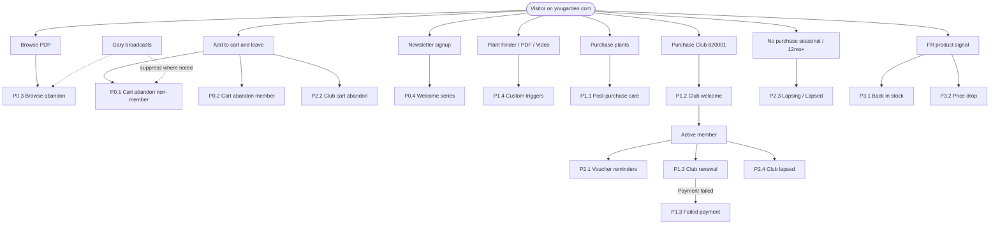

---

## Foundation (before P0)

Complete **once** before building any program.

### F.1 Fresh Relevance global trigger settings

| Setting | Value |
|---------|-------|
| Abandonment unattended interval | 15+ min |
| Contact remarketing pressure | ~24h (1435 min) |
| Remarketing slice size | ~120 min (align with program spacing) |
| Max cart items | 50 |
| Max cart value | £100k equivalent |
| Post-purchase abandon suppression | 1 day |
| Purchase signal dedupe | 60s / 600s |

Full detail: [fresh-relevance-trigger-settings-best-practices.md](./fresh-relevance-trigger-settings-best-practices.md)

### F.2 Dotdigital contact data fields

Create / sync these before programs go live:

| Field | Type | Source |
|-------|------|--------|
| `club_member` | Y/N | Order / account |
| `club_renewal_date` | Date | Account |
| `club_auto_renew` | Y/N | Account |
| `club_payment_failed` | Y/N | Payment webhook |
| `email_permission` | Y/N | Opt-in |
| `signup_discount_code` | Text | Signup form |
| `signup_discount_expiry` | Date | Signup form |
| `last_purchase_date` | Date | Orders |
| `last_purchase_category` | Text | Orders |
| `order_count` | Number | Orders |
| `lifetime_value` | Number | Orders |
| `rfm_segment` | Text | RFM job / segment |
| `voucher_5_balance` | Number | Club system |
| `voucher_pp_balance` | Number | Club system |

### F.3 Suppression rules (global)

| Rule | Applies to |
|------|------------|
| Exit on purchase | All abandon / welcome / win-back programs |
| Exit on unsubscribe | All programs |
| Club members excluded from “join Club” upsells | P0 cart E3, P0 browse, P1 post-purchase |
| Gary promo suppress segment → delay E2/E3 48h | P0 cart, P0 browse |
| Failed renewal → suppress join Club upsells | All acquisition |
| FR slice size blocks overlapping program **starts** | Cart vs browse |

### F.4 Jemma session outputs

- [ ] Segment dictionary (name, definition, owner)  
- [ ] `club_member` segment accurate  
- [ ] RFM or repeat-buyer segment for P0 cart  
- [ ] Seasonal lapsing segment definition (P2.3)  
- [ ] Gary broadcast suppress segment  

---

# P0 — September go-live

**Goal:** Highest-intent recovery + new subscriber onboarding.  
**Programs:** 5 (cart ×2, browse, welcome, welcome code expiry)

---

## P0.1 — Cart abandonment (non-member)

| | |
|--|--|
| **Program ID** | `P0-CART-ABANDON-NON-MEMBER` |
| **Platform** | FR cart trigger → Dotdigital program (or FR send via cart layout) |
| **Build order** | **#1** |

### Journey map

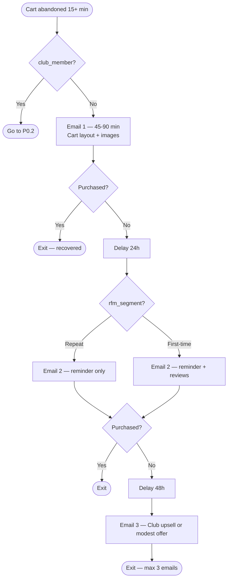

### Dotdigital program builder

| Step | Type | Config |
|------|------|--------|
| 1 | **Start** | FR integration enrolls contact OR segment: abandoned cart, `club_member = N`, email known |
| 2 | **Entry filter** | `email_permission = Y`, cart items ≤ 50, cart value < £100k, not in Gary suppress |
| 3 | **Action** | Send Email 1 (delay 45–90 min from enroll if DD-led) |
| 4 | **Decision** | Purchased since start? → Yes: exit |
| 5 | **Delay** | 24 hours |
| 6 | **Decision** | `rfm_segment` = repeat/high → Email 2A; else → Email 2B |
| 7 | **Decision** | Purchased? → exit |
| 8 | **Delay** | 48 hours |
| 9 | **Action** | Send Email 3 (Club maths or modest offer — RFM-led) |
| 10 | **Exit** | End program |

### Fresh Relevance

- Cart abandon trigger program (3 stages if FR sends directly)  
- Cart layout on all emails  
- Align stage delays with table above  
- Marketing rule: `club_member = N` for this program variant  

### Emails

| # | Timing | Subject angle | Dynamic content |
|---|--------|---------------|-----------------|
| E1 | 45–90 min | “Still thinking about your [plant]?” | Cart lines, images, total |
| E2a | +24h | Reminder only (repeat buyers) | Cart + dispatch info |
| E2b | +24h | Social proof (first-time) | Reviews + cart |
| E3 | +48h | “Save £X with Club for £10/yr” | Cart + break-even |

### Test scenario — Sarah (first-time)

1. Add lemon tree £24.99, abandon checkout (logged in or email captured).  
2. **Expect:** E1 ~1h with cart image.  
3. No purchase → E2 with reviews at +24h.  
4. No purchase → E3 Club upsell at +48h.  
5. Purchase after E2 → no E3.

### Go-live checklist

- [ ] FR cart trigger live, 15 min minimum delay  
- [ ] Cart layout renders correct SKU/image/price  
- [ ] `club_member = N` routes correctly (not P0.2)  
- [ ] Purchase exits program in DD + FR  
- [ ] Gary suppress segment tested  
- [ ] Test send to internal addresses  

---

## P0.2 — Cart abandonment (Club member)

| | |
|--|--|
| **Program ID** | `P0-CART-ABANDON-MEMBER` |
| **Build order** | **#2** (same FR trigger, branch on `club_member`) |

### Journey map

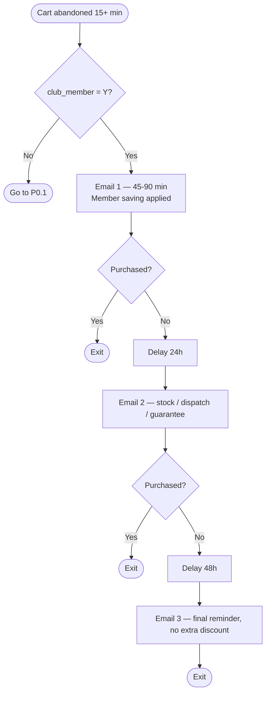

### Key rule

**Never escalate discount** for members — 15% already applied.

### Test scenario — Dave (member, £80 cart)

1. Member price shows £12 saving.  
2. E1 references member saving.  
3. E3 is reminder only — no new code.

### Go-live checklist

- [ ] `club_member = Y` only  
- [ ] Member savings dynamic field populates  
- [ ] No Club join CTA in any email  

---

## P0.3 — Browse abandonment

| | |
|--|--|
| **Program ID** | `P0-BROWSE-ABANDON` |
| **Build order** | **#3** |

### Journey map

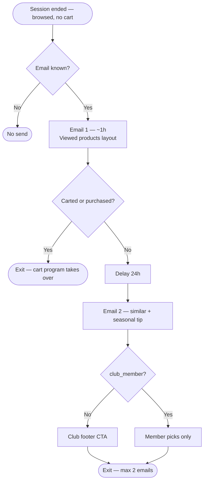

### Fresh Relevance

- Browse abandon trigger  
- Browse/cart layout (browsed products, not cart)  
- FR slice size: don’t start if cart abandon started within ~120 min  

### Test scenario — Emma (spring soft fruit)

1. View raspberries + strawberries, no cart.  
2. E1 within ~1h with viewed products + planting window.  
3. E2 at +24h with complementary products.  
4. Adds to cart → exits; cart program takes over.

### Go-live checklist

- [ ] Browse layout distinct from cart layout  
- [ ] No “your cart is waiting” copy  
- [ ] Slice size vs cart abandon verified  

---

## P0.4 — Welcome series (signup, pre-purchase)

| | |
|--|--|
| **Program ID** | `P0-WELCOME-SIGNUP` |
| **Sub-program** | `P0-WELCOME-CODE-EXPIRY` |
| **Build order** | **#4** |

### Journey map

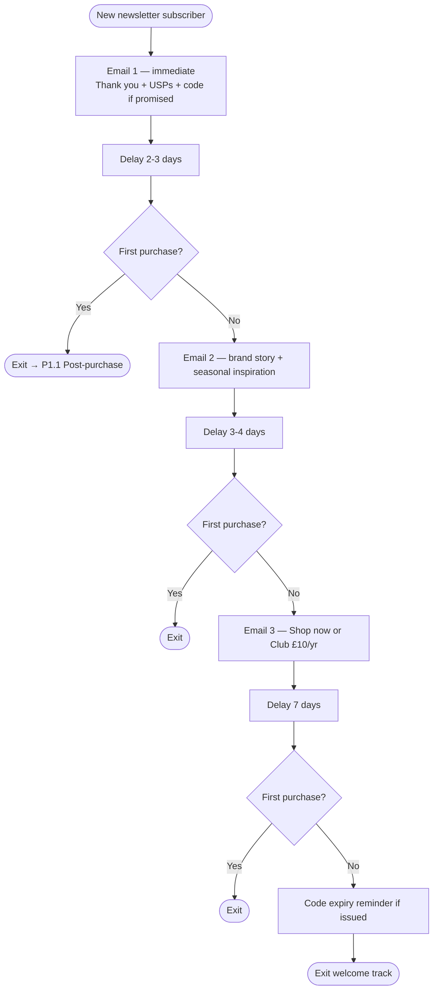

### Test scenario — Signup 10% off

1. Day 0: welcome + code + expiry.  
2. Day 3: inspiration email.  
3. Day 7: Club alternative.  
4. Day 14: code expiry nudge.  
5. First order any time → exit to P1.1.

### Go-live checklist

- [ ] Signup form enrolls program  
- [ ] Code + expiry fields populated  
- [ ] No overlap with Gary welcome if any  

---

## P0 phase sign-off

| Program | Status | Owner | Live date |
|---------|--------|-------|-----------|
| P0.1 Cart non-member | [ ] | | |
| P0.2 Cart member | [ ] | | |
| P0.3 Browse | [ ] | | |
| P0.4 Welcome | [ ] | | |

---

# P1 — Retention & Club lifecycle

**Goal:** Post-purchase care, Club onboarding, renewal.  
**Start after:** P0 live and stable (~2 weeks).

---

## P1.1 — Post-purchase care + Club upsell

| | |
|--|--|
| **Program ID** | `P1-POST-PURCHASE` |
| **Build order** | **#5** |

### Journey map

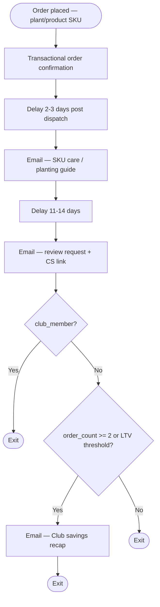

**Exclude:** Club SKU-only orders → route to P1.2 instead.

### Test scenario — Mark (hydrangea)

1. Day 3: planting guide for hydrangea SKU.  
2. Day 14: review ask.  
3. If 2+ orders and not Club: savings recap.

### Go-live checklist

- [ ] Order webhook enrolls program  
- [ ] SKU-dynamic care content works  
- [ ] Club-only orders excluded  

---

## P1.2 — Club welcome + login reminder

| | |
|--|--|
| **Program ID** | `P1-CLUB-WELCOME` |
| **Build order** | **#6** |
| **Trigger SKU** | `820001` |

### Journey map

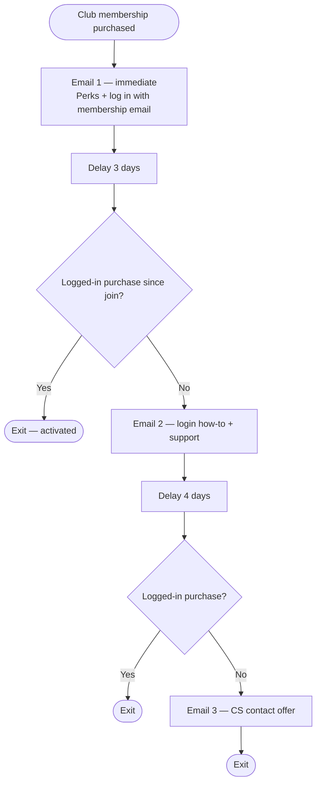

### Test scenario — Buys Club as guest

1. Immediate welcome + login CTA.  
2. Day 3: “15% not showing?” help email.  
3. Logs in and orders → exit.

### Go-live checklist

- [ ] `club_member` set on purchase  
- [ ] Login detection field or proxy (logged-in order flag)  
- [ ] Links to account / support  

---

## P1.3 — Club pre-renewal + failed payment

| | |
|--|--|
| **Program ID** | `P1-CLUB-RENEWAL` |
| **Sub-program** | `P1-CLUB-PAYMENT-FAILED` |
| **Build order** | **#7** |

### Journey map — renewal

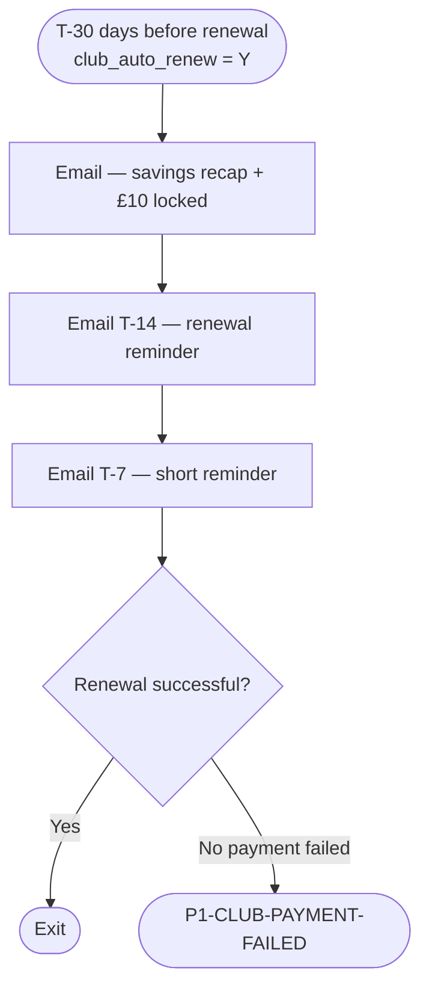

### Journey map — failed payment

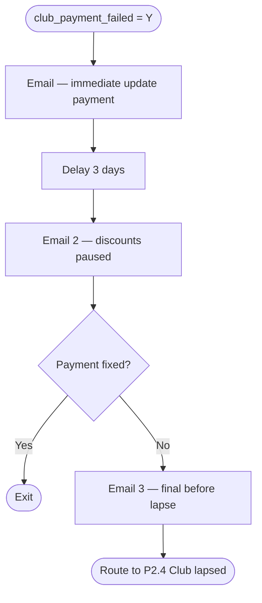

### Test scenario

1. T-30: “You saved £47; renews at £10 — price never goes up.”  
2. Failed card: immediate update payment; suppress all join Club upsells.

### Go-live checklist

- [ ] `club_renewal_date` synced daily  
- [ ] Payment failure webhook sets `club_payment_failed`  
- [ ] Suppress join Club globally on failed payment  

---

## P1.4 — Custom triggers (phase 1b)

Build after core P1 or in parallel if dev resource available.

| ID | Event | Journey summary |
|----|-------|-----------------|
| `P1-CT-PLANT-FINDER` | `PlantFinderComplete` | +1h results email → +24h seasonal tip → exit on purchase |
| `P1-CT-GUIDE-DOWNLOAD` | `PlantingGuideDownload` | +2h guide + products → +3d Club mention (non-member) |
| `P1-CT-VIDEO` | `VideoWatched` (≥50%) | +4h related products from video metadata |

### Plant Finder journey (example)

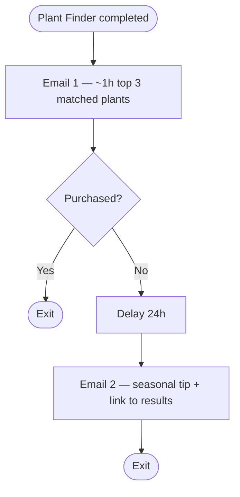

**Dev required:** `window.ddg.event("PlantFinderComplete", { email, space, sunlight, resultCount })`  
Docs: [Custom event examples](https://developer.freshrelevance.com/docs/custom-event-examples.md)

---

## P1 phase sign-off

| Program | Status | Owner | Live date |
|---------|--------|-------|-----------|
| P1.1 Post-purchase | [ ] | | |
| P1.2 Club welcome | [ ] | | |
| P1.3 Club renewal | [ ] | | |
| P1.4 Custom triggers | [ ] | | |

---

# P2 — Club engagement & seasonal retention

**Goal:** Vouchers, Club cart recover, lapsing/lapsed.  
**Start after:** P1 Club welcome live.

---

## P2.1 — Club voucher reminders

| | |
|--|--|
| **Programs** | `P2-CLUB-VOUCHER-5` / `P2-CLUB-VOUCHER-PP` |
| **Build order** | **#8** |

### Journey map (£5 voucher)

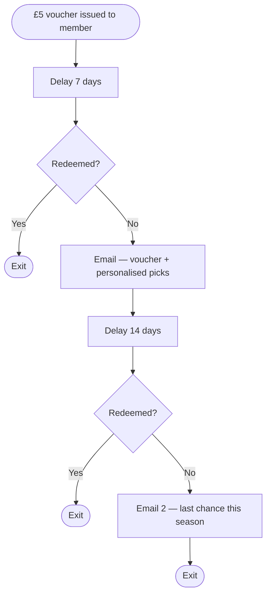

### P&P variant

Start when `voucher_pp_balance > 0` AND (`cart_value >= £40` OR recent browse with cart intent).

---

## P2.2 — Club cart abandonment

| | |
|--|--|
| **Program ID** | `P2-CLUB-CART-ABANDON` |
| **Build order** | **#9** |

### Journey map

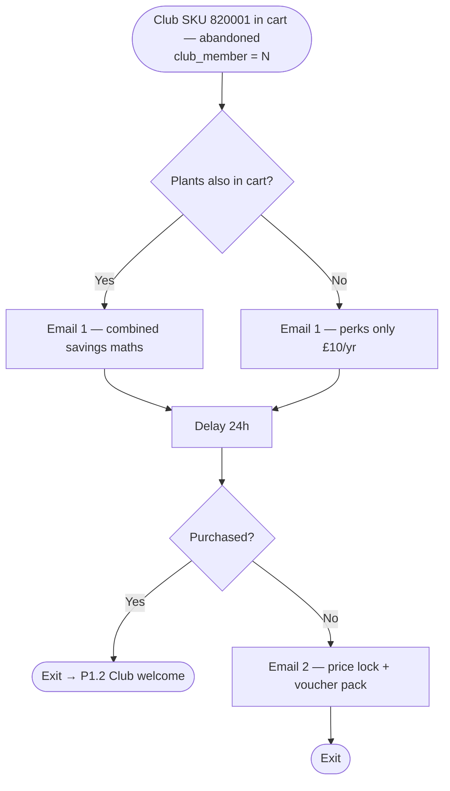

---

## P2.3 — Seasonal lapsing & lapsed win-back

| | |
|--|--|
| **Programs** | `P2-LAPSING-SEASONAL` / `P2-LAPSED-WINBACK` |
| **Build order** | **#10** |
| **Owner** | Jemma defines segments |

### Lapsing journey (seasonal)

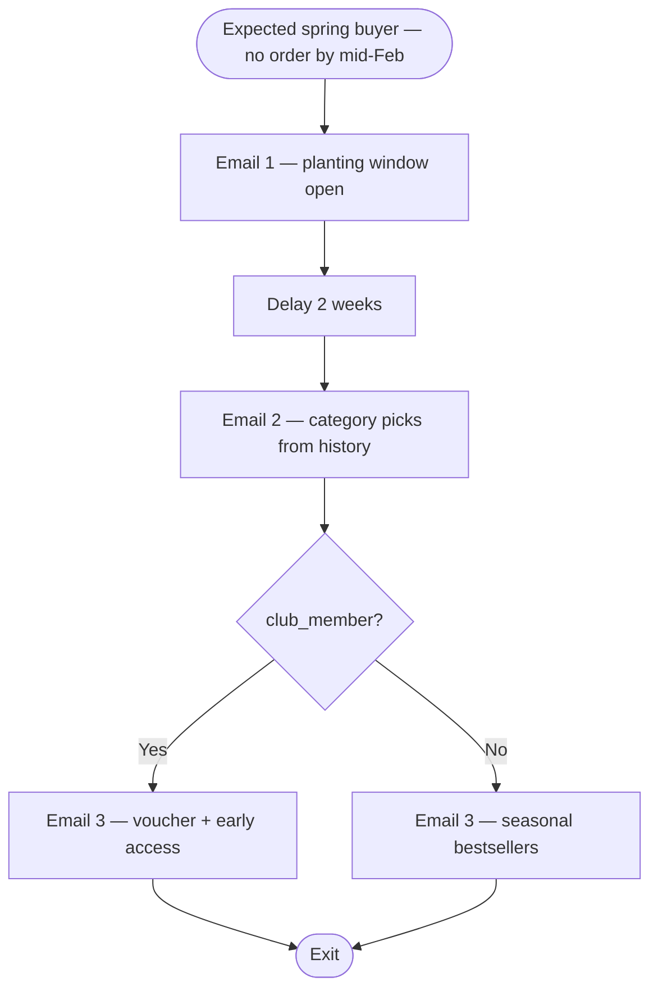

### Lapsed win-back (12+ months)

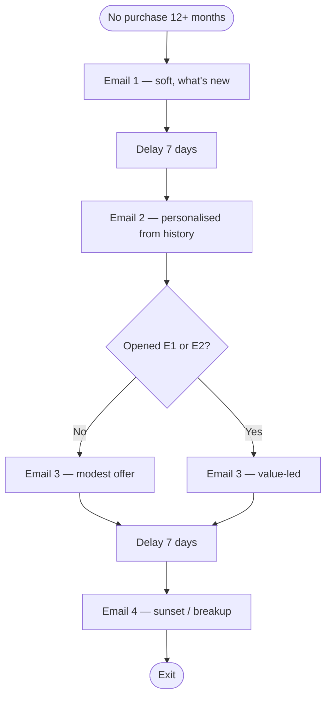

---

## P2.4 — Club lapsed (expired / cancelled)

| | |
|--|--|
| **Program ID** | `P2-CLUB-LAPSED` |
| **Build order** | **#11** |

### Journey map

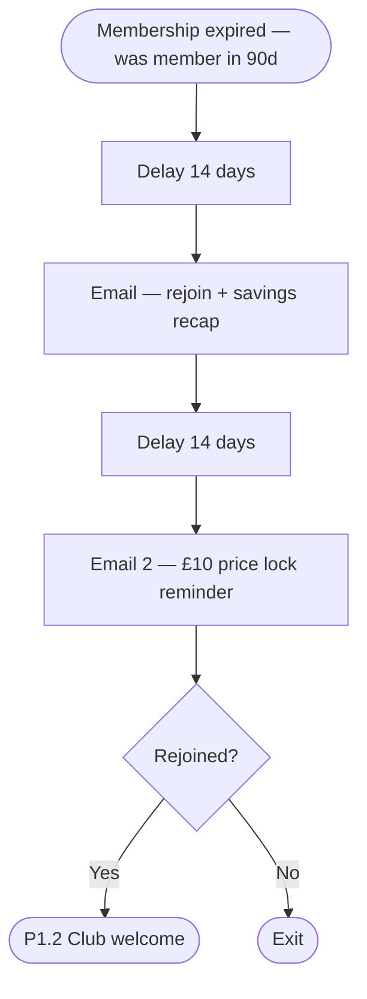

---

## P2 phase sign-off

| Program | Status | Owner | Live date |
|---------|--------|-------|-----------|
| P2.1 Vouchers | [ ] | | |
| P2.2 Club cart abandon | [ ] | | |
| P2.3 Lapsing / Lapsed | [ ] | | |
| P2.4 Club lapsed | [ ] | | |

---

# P3 — Growth & product signals

**Goal:** Product triggers, member early access, high-LTV Club pitch.  
**Start after:** P2 stable or seasonal need.

---

## P3.1 — Back in stock

| | |
|--|--|
| **Program ID** | `P3-BACK-IN-STOCK` |
| **Build order** | **#12** |

### Journey map

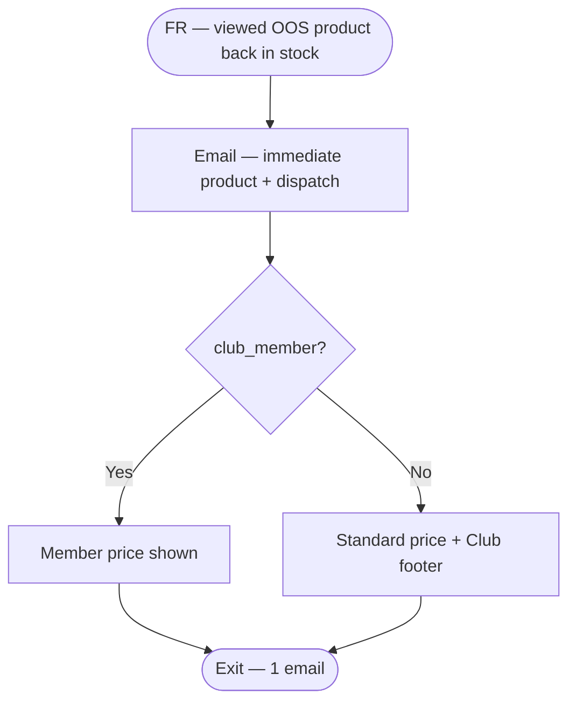

---

## P3.2 — Price drop

| | |
|--|--|
| **Program ID** | `P3-PRICE-DROP` |
| **Build order** | **#13** |

### Journey map

Same single-email pattern as P3.1.

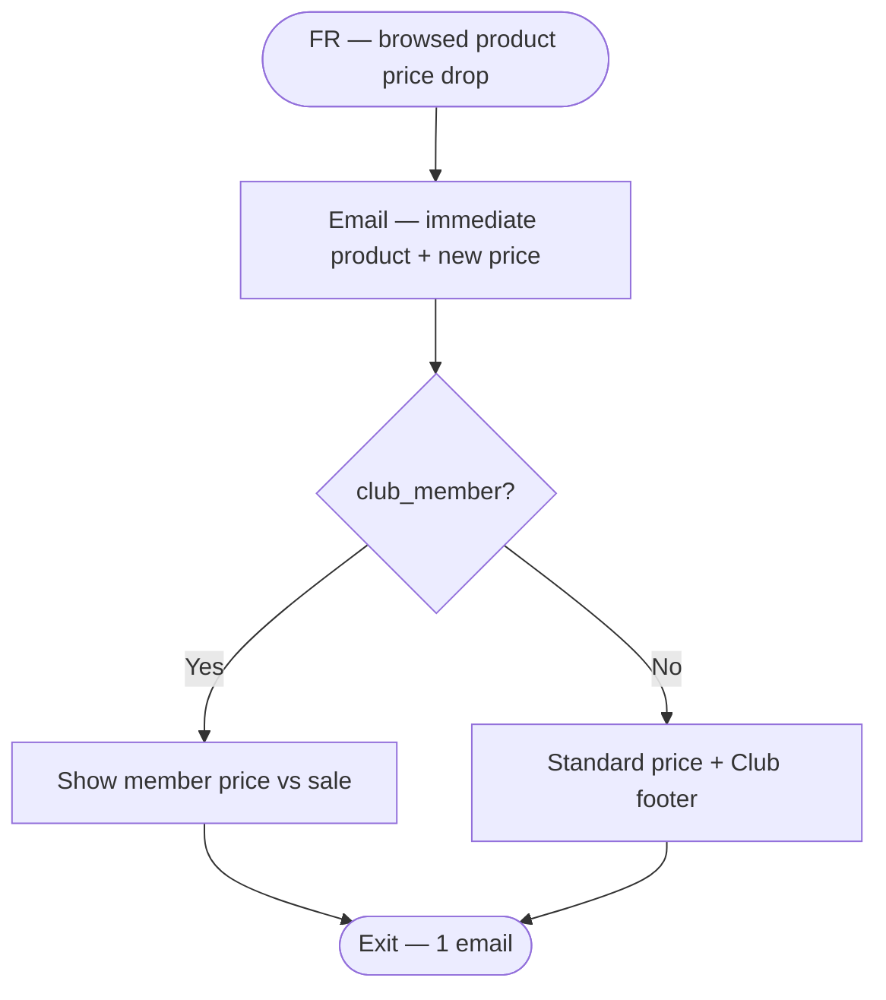

**Caution:** Members already have 15% — show member price vs sale clearly.

---

## P3.3 — Member early access (Gary coordination)

| | |
|--|--|
| **Program ID** | `P3-MEMBER-EARLY-ACCESS` |
| **Build order** | **#14** |

### Journey map

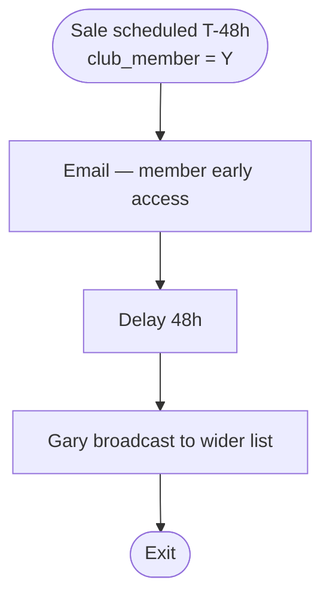

---

## P3.4 — High-LTV Club pitch

| | |
|--|--|
| **Program ID** | `P3-CLUB-HIGH-LTV` |
| **Build order** | **#15** |

### Journey map

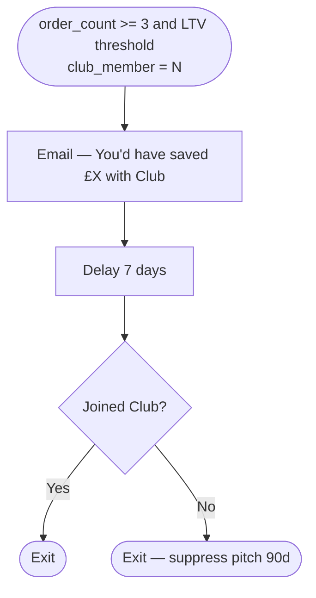

---

## P3 phase sign-off

| Program | Status | Owner | Live date |
|---------|--------|-------|-----------|
| P3.1 Back in stock | [ ] | | |
| P3.2 Price drop | [ ] | | |
| P3.3 Member early access | [ ] | | |
| P3.4 High-LTV Club | [ ] | | |

---

# Implementation order (master checklist)

Tick programs **in this order only** — each depends on the rows above.

| # | ID | Priority | Depends on |
|---|-----|----------|------------|
| 0 | Foundation F.1–F.4 | — | — |
| 1 | `P0-CART-ABANDON-NON-MEMBER` | P0 | FR cart + cart layout |
| 2 | `P0-CART-ABANDON-MEMBER` | P0 | #1 |
| 3 | `P0-BROWSE-ABANDON` | P0 | FR browse |
| 4 | `P0-WELCOME-SIGNUP` | P0 | Signup form |
| 5 | `P1-POST-PURCHASE` | P1 | Order webhook |
| 6 | `P1-CLUB-WELCOME` | P1 | Club SKU 820001 |
| 7 | `P1-CLUB-RENEWAL` | P1 | `club_renewal_date` |
| 8 | `P2-CLUB-VOUCHER-*` | P2 | Voucher events |
| 9 | `P2-CLUB-CART-ABANDON` | P2 | Club in cart detection |
| 10 | `P2-LAPSING-*` | P2 | Jemma segments |
| 11 | `P2-CLUB-LAPSED` | P2 | #7 |
| 12 | `P3-BACK-IN-STOCK` | P3 | FR product segment |
| 13 | `P3-PRICE-DROP` | P3 | FR product segment |
| 14 | `P3-MEMBER-EARLY-ACCESS` | P3 | Gary calendar |
| 15 | `P3-CLUB-HIGH-LTV` | P3 | RFM / LTV fields |
| — | `P1-CT-*` Custom triggers | P1b | Dev events (parallel ok) |

---

# Per-program implementation template (copy for each new build)

```
PROGRAM ID:
OWNER:
TARGET LIVE DATE:

PREREQUISITES
[ ] Contact fields exist
[ ] FR trigger / webhook ready
[ ] Email creative approved
[ ] Suppression segments defined
[ ] Test contacts identified

DOTDIGITAL
[ ] Program created
[ ] Start condition configured
[ ] Entry filters set
[ ] Decisions / delays / actions match journey map
[ ] Exit on purchase + unsubscribe
[ ] Program activated (test mode)

FRESH RELEVANCE
[ ] Trigger program / marketing rule
[ ] Cart or browse layout attached
[ ] Global settings verified

TEST
[ ] Internal test send — all branches
[ ] Purchase exit works
[ ] Member vs non-member branch (if applicable)
[ ] Gary suppress tested

GO LIVE
[ ] Program set to active
[ ] Monitored 48h
[ ] Metrics baseline recorded
```

---

# Metrics (per program)

| Program type | Primary KPI |
|--------------|-------------|
| Cart / browse abandon | Recovered revenue, conversion rate |
| Welcome | First purchase rate, time to first order |
| Post-purchase | Review rate, 2nd purchase rate |
| Club welcome | Login within 7d, first member order |
| Club renewal | Renew rate, failed payment recovery |
| Vouchers | Redemption rate |
| Lapsing / lapsed | Reactivation rate, unsubscribe rate |
| Product triggers | Click rate, conversion per send |

---

*Last updated: implementation playbook v2 — Mermaid journey maps (Cursor / GitHub preview).*
