# YouGarden — Dotdigital Program Mappings

**Related:** [Implementation playbook](./yougarden-automation-implementation-playbook.md) (step-by-step, ASCII flows) · [Automation roadmap](./yougarden-automation-roadmap.md) · [Migration research](./dotdigital-automation-migration-research.md)

Maps each priority program to **Dotdigital Program Builder** structure: start condition → decisions → actions → exits. Fresh Relevance (FR) handles behavioural triggers where noted; Dotdigital orchestrates sends, splits, and reporting.

---

## Platform overview

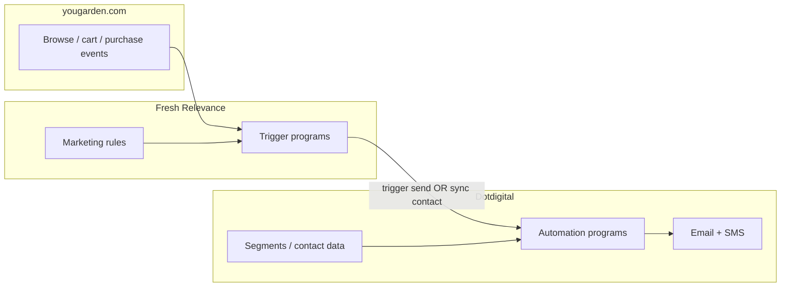

### Shared contact data fields (Dotdigital)

| Field | Used by |
|-------|---------|
| `club_member` (Y/N) | All programs — branch member vs non-member |
| `club_renewal_date` | P1 renewal, P2 voucher timing |
| `club_auto_renew` (Y/N) | P1 pre-renewal |
| `club_payment_failed` (Y/N) | P1 failed renewal |
| `email_permission` | All sends |
| `signup_discount_code` / `signup_discount_expiry` | P0 welcome |
| `last_purchase_date` | P1 post-purchase, P2 lapsing |
| `last_purchase_category` | P1 care content, P2 seasonal |
| `rfm_segment` | P0 cart abandon offer logic |
| `voucher_5_balance` / `voucher_pp_balance` | P2 Club voucher programs |
| `products_in_cart` / `cart_value` | P0 cart abandon (from FR) |
| `products_browsed` | P0 browse abandon (from FR) |

---

# P0 — September go-live

**Goal:** Recover highest-intent sessions and onboard new subscribers. Four Dotdigital programs (cart abandon has two variants).

---

## P0.1 — Cart abandonment (non-member)

| Dotdigital element | Mapping |
|--------------------|---------|
| **Program name** | `P0-CART-ABANDON-NON-MEMBER` |
| **Start condition** | FR cart-abandon trigger fires → contact enrolled via integration **OR** segment: cart abandoned in last 15 min, no purchase, `club_member = N` |
| **Entry filters** | Email captured; email permission; cart value &lt; £100k; cart items ≤ 50; not in Gary suppress segment |
| **FR trigger** | Cart abandon program — stage 1/2/3 delays align with DD delays |

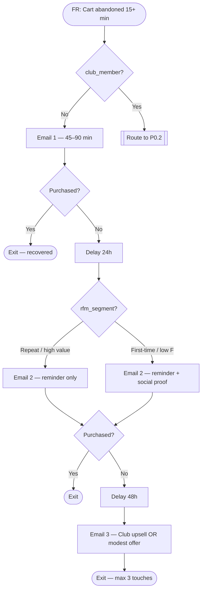

### Use case — Sarah, first-time buyer

| Step | What happens |
|------|----------------|
| **Trigger** | Adds lemon tree (£24.99) to cart; leaves checkout |
| **45 min** | Email 1: cart image, “Your lemon tree is reserved”, dispatch info |
| **+24h** | Email 2: reviews + planting tips (no discount — first-time, test offer on E3 only) |
| **+48h** | Email 3: “Join Club for £10 — save on this order” + return-to-cart link |
| **Exit** | Purchases on Email 2 → program ends; no Email 3 |

### Email content map

| Stage | Subject angle | Dynamic content (FR cart layout) |
|-------|---------------|----------------------------------|
| E1 | “Still thinking about your [plant]?” | Cart lines, images, total |
| E2 | “Customers love this variety” | Reviews + same cart |
| E3 | “Save £X with Club” | Cart + Club break-even calc |

### Exits & suppressions

- Purchase at any stage → exit all programs
- Enters `P0-BROWSE-ABANDON` within FR slice window → browse program blocked (FR setting)
- Gary promo suppress segment active → delay E2/E3 by 48h

---

## P0.2 — Cart abandonment (Club member)

| Dotdigital element | Mapping |
|--------------------|---------|
| **Program name** | `P0-CART-ABANDON-MEMBER` |
| **Start condition** | Same FR cart trigger; decision routes `club_member = Y` |
| **Entry filters** | Logged-in member session preferred; member discount already in cart data |

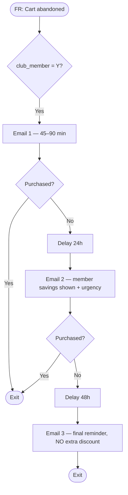

### Use case — Dave, Club member

| Step | What happens |
|------|----------------|
| **Trigger** | £80 plants in cart; 15% member saving (£12) already applied |
| **1h** | “Complete your order — £12 member saving applied” |
| **+24h** | Stock/dispatch window + nursery guarantee |
| **+48h** | Final reminder only — **no** discount escalation |
| **Exit** | Completes order after Email 1 |

---

## P0.3 — Browse abandonment

| Dotdigital element | Mapping |
|--------------------|---------|
| **Program name** | `P0-BROWSE-ABANDON` |
| **Start condition** | FR browse-abandon trigger; viewed ≥1 product; no cart add; no purchase |
| **Entry filters** | Email known; not purchased in last 24h; not in active cart-abandon program (FR slice) |
| **FR trigger** | Browse abandon — one site brand per email if applicable |

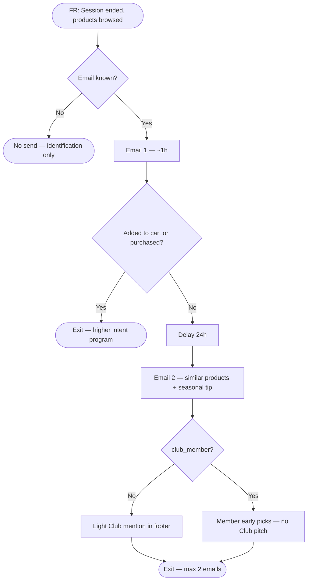

### Use case — Emma, spring browser

| Step | What happens |
|------|----------------|
| **Trigger** | Views bare-root raspberries + strawberries; leaves without carting |
| **1h** | Email 1: viewed products + “Plant bare-root before [date]” |
| **+24h** | Email 2: complementary soft fruit + bestsellers |
| **Branch** | Non-member → footer CTA “Club members save 15% all year” |
| **Exit** | Adds to cart → cart abandon program takes over; purchase → exit |

---

## P0.4 — Welcome series (newsletter signup, pre-purchase)

| Dotdigital element | Mapping |
|--------------------|---------|
| **Program name** | `P0-WELCOME-SIGNUP` |
| **Start condition** | New contact added to “Newsletter” address book with opt-in **OR** signup form submission webhook |
| **Entry filters** | `last_purchase_date` is empty; email permission = Y |
| **FR role** | Optional — capture browse data after signup for Email 2 personalisation |

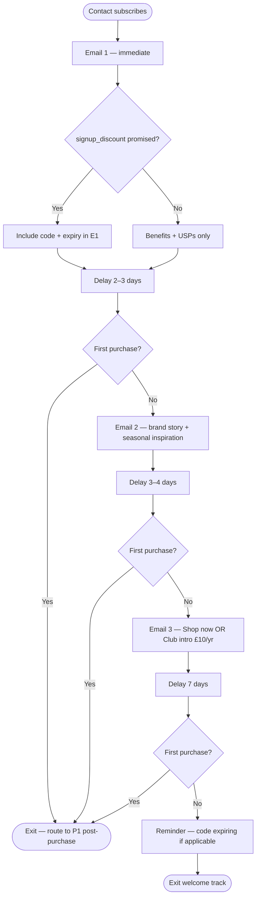

### Use case — Signup for 10% off, no purchase

| Step | What happens |
|------|----------------|
| **Day 0** | Email 1: welcome + `WELCOME10` code + expiry date |
| **Day 3** | Email 2: spring planting inspiration + bestsellers |
| **Day 7** | Email 3: “Still thinking?” + Club as alternative to one-off code |
| **Day 14** | Code expiry reminder (sub-program or decision branch) |
| **Exit** | First order placed → hand off to P1 post-purchase |

### Signup discount sub-track

| Dotdigital element | Mapping |
|--------------------|---------|
| **Program name** | `P0-WELCOME-CODE-EXPIRY` |
| **Start condition** | Enrolled from welcome; `signup_discount_expiry` within 3 days; no purchase |

---

## P0 summary matrix

| Program | DD start | FR trigger | Emails | Key decision |
|---------|----------|------------|--------|--------------|
| Cart abandon (non-member) | FR cart + not member | Yes | 3 | RFM on E2/E3 |
| Cart abandon (member) | FR cart + member | Yes | 3 | No discount escalation |
| Browse abandon | FR browse | Yes | 2 | Club mention E2 if non-member |
| Welcome signup | New subscriber | Optional | 3 + expiry | Purchase exits to P1 |

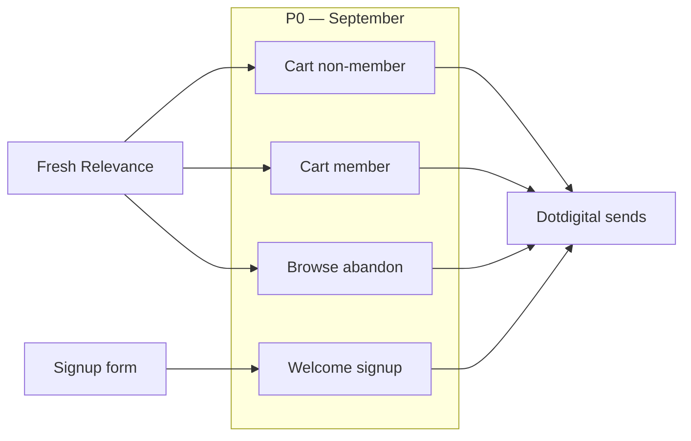

---

# P1 — Retention & Club lifecycle

**Goal:** Post-purchase care, Club onboarding, renewal reliability.

---

## P1.1 — Post-purchase care + Club upsell

| Dotdigital element | Mapping |
|--------------------|---------|
| **Program name** | `P1-POST-PURCHASE` |
| **Start condition** | Order placed webhook / FR purchase complete → exclude Club SKU-only orders to P1.3 |
| **Entry filters** | Contains plant/product SKU (not membership-only) |

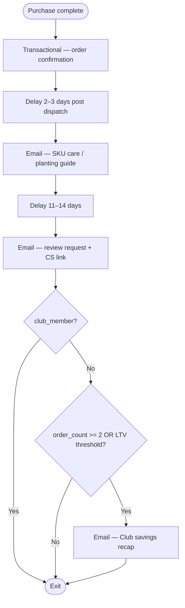

### Use case — Mark buys a hydrangea

| Step | What happens |
|------|----------------|
| **Immediate** | Order confirmation (transactional, on-brand) |
| **Day 3** | “How to plant your hydrangea” — dynamic SKU content |
| **Day 14** | Review request with product image |
| **Branch** | 2+ lifetime orders, not Club → “You’d have saved £X with Club” |

---

## P1.2 — Club welcome + login reminder

| Dotdigital element | Mapping |
|--------------------|---------|
| **Program name** | `P1-CLUB-WELCOME` |
| **Start condition** | Purchase of SKU `820001` (Club membership) |
| **Entry filters** | `club_member` set to Y on contact record |

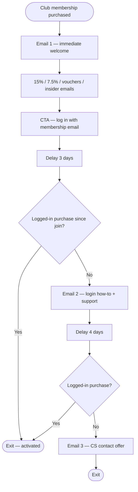

### Use case — Buys Club, shops as guest

| Step | What happens |
|------|----------------|
| **Immediate** | Welcome + full perk list + login CTA |
| **Day 3** | “Your 15% isn’t showing?” — same-email login steps |
| **Day 7** | Link to member support if still no logged-in order |

---

## P1.3 — Club pre-renewal + failed payment

| Dotdigital element | Mapping |
|--------------------|---------|
| **Program name** | `P1-CLUB-RENEWAL` |
| **Start condition** | `club_renewal_date` minus 30 days; `club_auto_renew = Y` |
| **Parallel program** | `P1-CLUB-PAYMENT-FAILED` on `club_payment_failed = Y` |

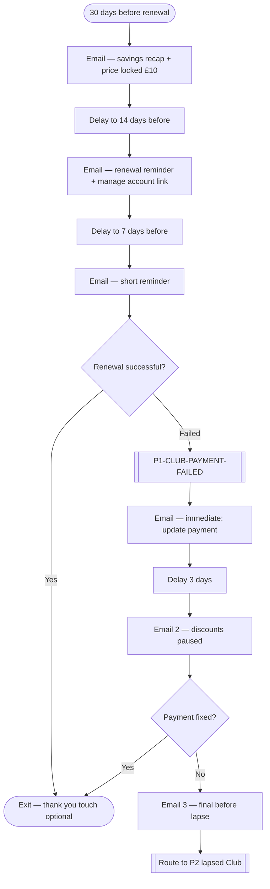

### Use case — Auto-renew in 14 days

| Step | What happens |
|------|----------------|
| **T-30d** | “You saved £47 this year; renews at £10 — price never goes up” |
| **T-14d** | Renewal date + account management link |
| **T-7d** | Short reminder |
| **Failed** | Immediate payment update; suppress all Club join upsells |

---

## P1 summary matrix

| Program | DD start | Emails | Key exit |
|---------|----------|--------|----------|
| Post-purchase | Order webhook | 2–3 + optional Club upsell | Club join or review done |
| Club welcome | Club SKU purchase | 3 | Logged-in purchase |
| Club renewal | `club_renewal_date` | 3 + failed branch | Successful renew |

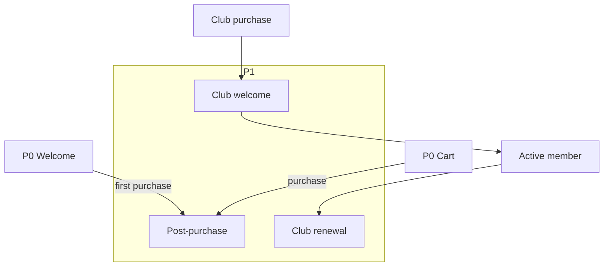

---

# P2 — Club engagement & seasonal retention

**Goal:** Drive voucher redemption, recover Club cart abandons, win back seasonal buyers.

---

## P2.1 — Club voucher reminders (£5 + P&P)

| Dotdigital element | Mapping |
|--------------------|---------|
| **Program name** | `P2-CLUB-VOUCHER-5` / `P2-CLUB-VOUCHER-PP` |
| **Start condition** | Voucher issued webhook → `voucher_5_balance` incremented **OR** scheduled seasonal issue date |
| **Entry filters** | `club_member = Y`; voucher unused |

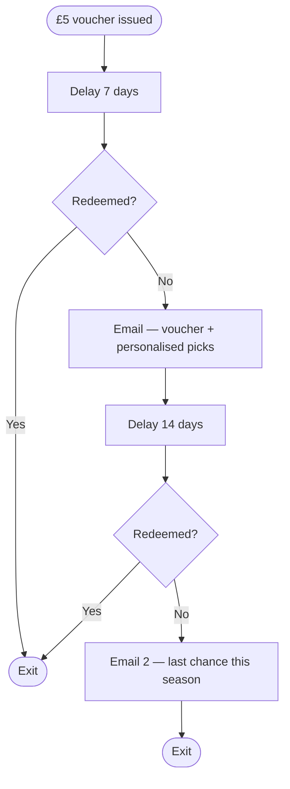

### P&P voucher variant

| Start | Extra filter |
|-------|----------------|
| `voucher_pp_balance > 0` | `cart_value >= £40` in last 7 days OR browse session with cart |

### Use case — Spring £5 voucher unused

| Step | What happens |
|------|----------------|
| **Issue** | Seasonal £5 voucher credited to account |
| **Day 7** | “Your £5 spring voucher” + potato planter picks if bought veg before |
| **Day 21** | Last chance before next seasonal campaign |

---

## P2.2 — Club join cart abandonment

| Dotdigital element | Mapping |
|--------------------|---------|
| **Program name** | `P2-CLUB-CART-ABANDON` |
| **Start condition** | Cart contains SKU `820001` with or without plants; no purchase |
| **Entry filters** | `club_member = N` |

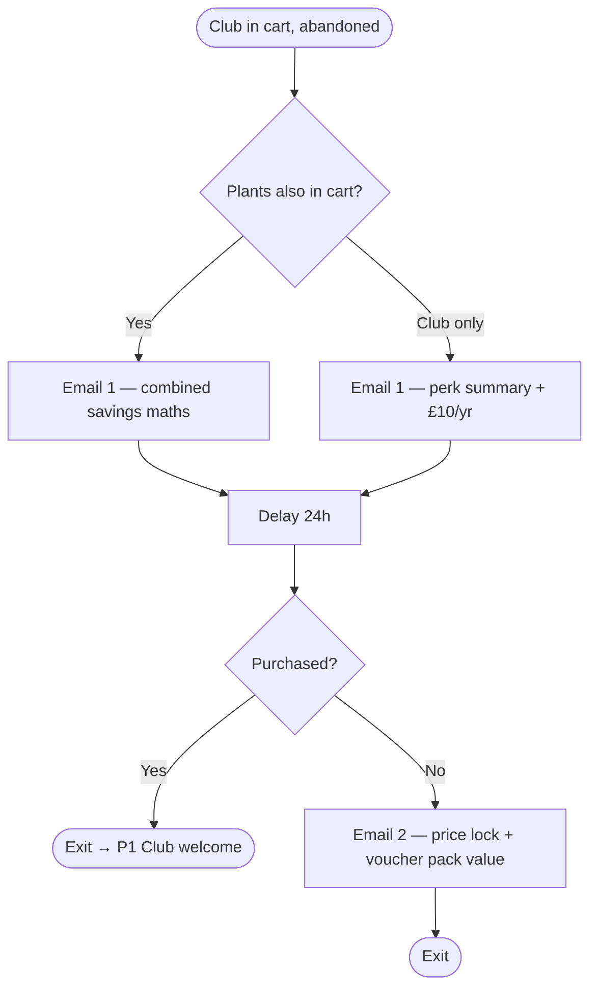

### Use case — Club + £60 plants abandoned

| Step | What happens |
|------|----------------|
| **1h** | “Save £9 on this order + £20 vouchers — complete join for £10” |
| **+24h** | Full perk breakdown + return-to-cart |

---

## P2.3 — Seasonal lapsing & lapsed win-back

| Dotdigital element | Mapping |
|--------------------|---------|
| **Program name** | `P2-LAPSING-SEASONAL` / `P2-LAPSED-WINBACK` |
| **Start condition** | Segment from Jemma: expected spring buyer, no purchase by mid-Feb **OR** no purchase 12+ months |
| **FR rule** | Lapse buyer behavioural rule optional |

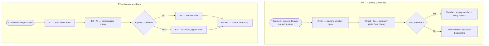

### Use case — Lapsing Club member

| Step | What happens |
|------|----------------|
| **Trigger** | Bought spring plants last March; no 2026 purchase by 15 Feb |
| **Email 1** | “Time to plan spring” + bare-root in stock |
| **Email 2** | Club spring voucher + member-only picks |

### Use case — Lapsed 14 months

| Step | What happens |
|------|----------------|
| **E1** | What’s new this season — no discount |
| **E2** | Plants from last order category |
| **E3** | Offer only if no engagement on E1–E2 |
| **E4** | “Should we stop emailing?” — deliverability protection |

---

## P2.4 — Club lapsed (cancelled / expired)

| Dotdigital element | Mapping |
|--------------------|---------|
| **Program name** | `P2-CLUB-LAPSED` |
| **Start condition** | `club_member` flips to N after expiry; was member in last 90 days |

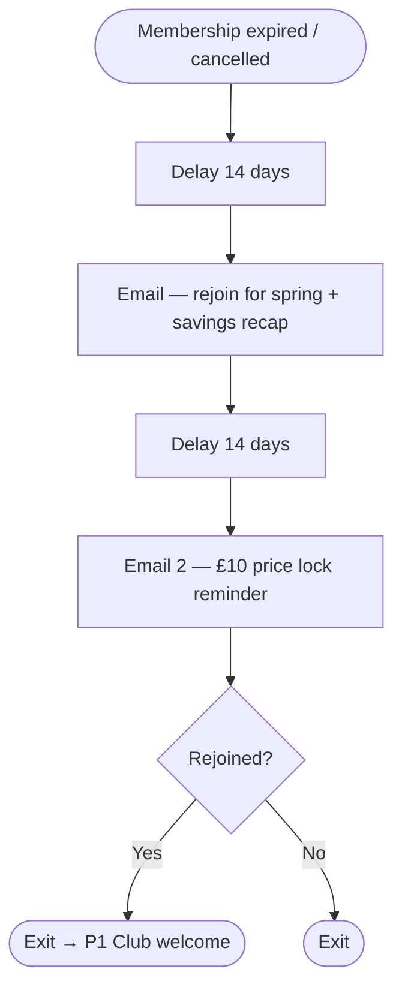

---

## P2 summary matrix

| Program | DD start | Club? | Emails |
|---------|----------|-------|--------|
| £5 voucher reminder | Voucher issued | Yes | 2 |
| P&P voucher | Voucher + cart/browse | Yes | 1–2 |
| Club cart abandon | Club SKU in cart | Join | 2 |
| Seasonal lapsing | Jemma segment | Branch | 2–3 |
| Lapsed win-back | 12mo inactive | Optional offer | 4 |
| Club lapsed | Membership ended | Rejoin | 2 |

---

# P3 — Growth & product triggers

**Goal:** Timely product signals and high-value acquisition.

---

## P3.1 — Back in stock

| Dotdigital element | Mapping |
|--------------------|---------|
| **Program name** | `P3-BACK-IN-STOCK` |
| **Start condition** | FR back-in-stock trigger on viewed/OOS product |
| **Entry filters** | Viewed product ≥2 times OR in wishlist; not purchased |

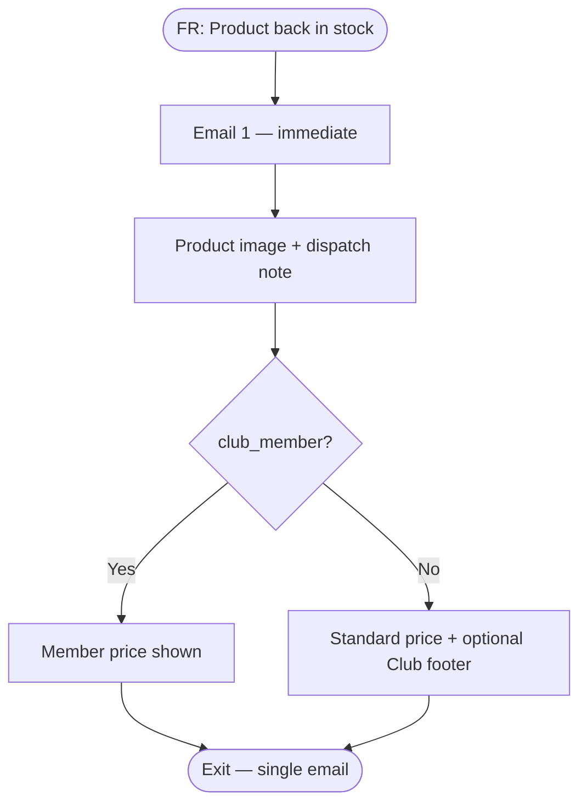

### Use case — Sold-out rose restocked

Lisa viewed climbing rose 3× in February → instant email when stock returns.

---

## P3.2 — Price drop alert

| Dotdigital element | Mapping |
|--------------------|---------|
| **Program name** | `P3-PRICE-DROP` |
| **Start condition** | FR price-drop trigger on browsed product |
| **Caution** | Members already have 15% — message “member price” vs sale price to avoid confusion |

---

## P3.3 — Member early access (Gary sale coordination)

| Dotdigital element | Mapping |
|--------------------|---------|
| **Program name** | `P3-MEMBER-EARLY-ACCESS` |
| **Start condition** | Manual/program push 24–48h before Gary sale segment send |
| **Entry filters** | `club_member = Y` |

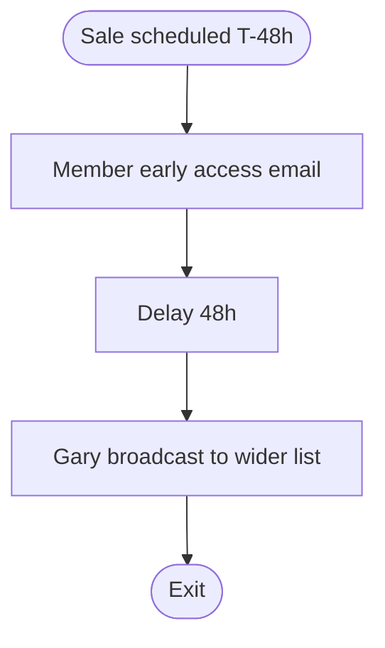

---

## P3.4 — High-LTV Club pitch

| Dotdigital element | Mapping |
|--------------------|---------|
| **Program name** | `P3-CLUB-HIGH-LTV` |
| **Start condition** | `order_count >= 3` AND `lifetime_value >= threshold` AND `club_member = N` |
| **Trigger** | Post-purchase decision in P1 **OR** standalone monthly segment refresh |

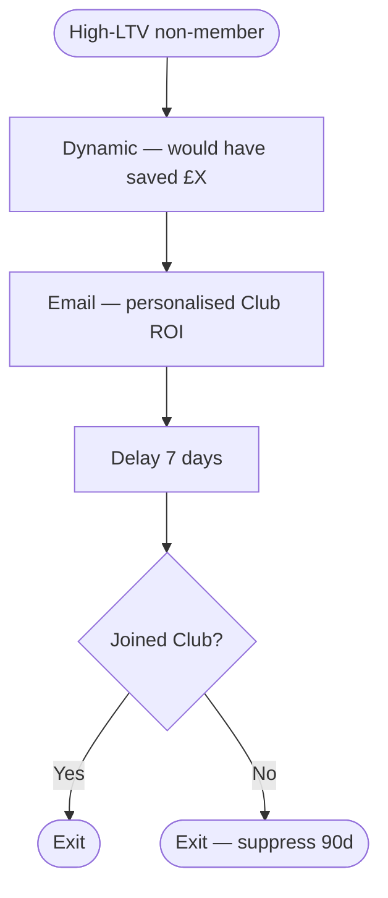

---

## P3 summary matrix

| Program | DD start | FR trigger | Sends |
|---------|----------|------------|-------|
| Back in stock | FR product change | Yes | 1 |
| Price drop | FR product change | Yes | 1 |
| Member early access | Scheduled / manual | No | 1 |
| High-LTV Club pitch | Segment / post-purchase | No | 1 |

---

# Cross-program routing

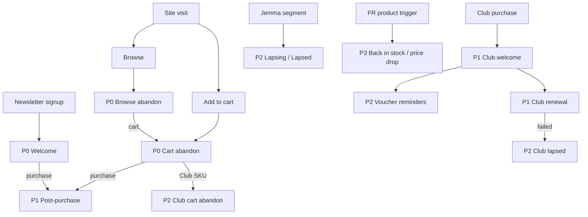

---

# Build order checklist (Dotdigital)

| Order | Program ID | Depends on |
|-------|------------|------------|
| 1 | `P0-CART-ABANDON-*` | FR cart trigger + cart layouts |
| 2 | `P0-BROWSE-ABANDON` | FR browse trigger |
| 3 | `P0-WELCOME-SIGNUP` | Signup form / address book |
| 4 | `P1-POST-PURCHASE` | Order webhook |
| 5 | `P1-CLUB-WELCOME` | Club SKU + contact fields |
| 6 | `P1-CLUB-RENEWAL` | `club_renewal_date` synced |
| 7 | `P2-CLUB-VOUCHER-*` | Voucher issue events |
| 8 | `P2-CLUB-CART-ABANDON` | Club in cart detection |
| 9 | `P2-LAPSING-*` | Jemma segments |
| 10 | `P3-*` | FR product segments |
